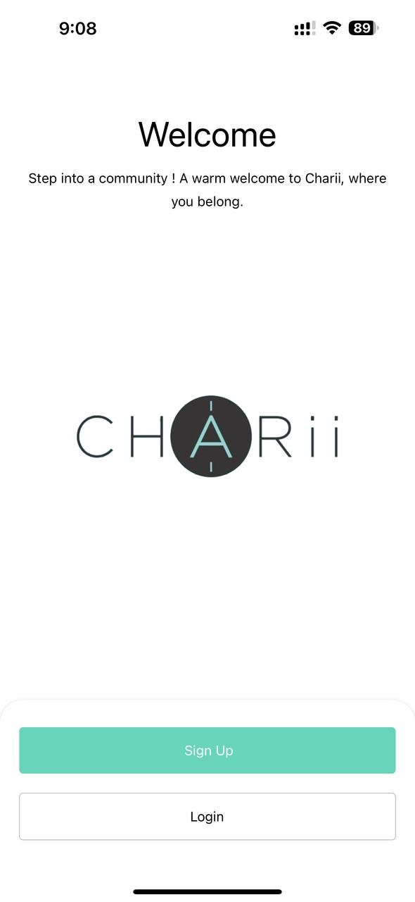
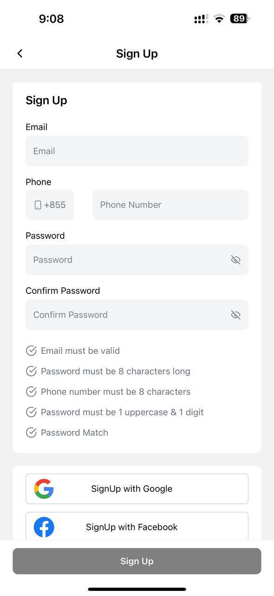

# ⏰ How to Create an Account

### 1. Open the App

Launch the application on your device.

<figure><figcaption></figcaption></figure>

### 2. Click Sign up

<figure><figcaption></figcaption></figure>

Enter the required details:

* Email
* Phone Number
* Password&#x20;
* Confirm Password

Validation Checks:

* Email Validation : Ensure the email provided follows a valid format.
* Password Validation : Verify that the password is at least 8 characters long, includes at least 1 uppercase letter, and has at least 1 digit.
* Password Confirmation : Matched the entered password with the confirmation password.&#x20;
* Phone Number Validation : Confirm that the entered phone number is accurate.

Completion :&#x20;

* If all validations pass, proceed to complete that sign up process.
* If there are errors, it will show clear feedback on what needs correction.
