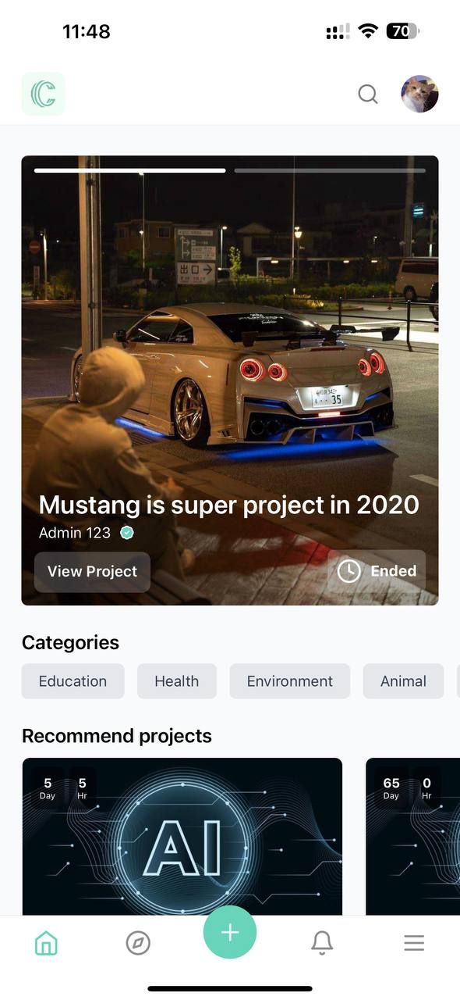
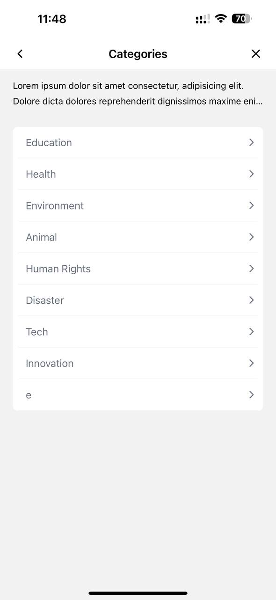
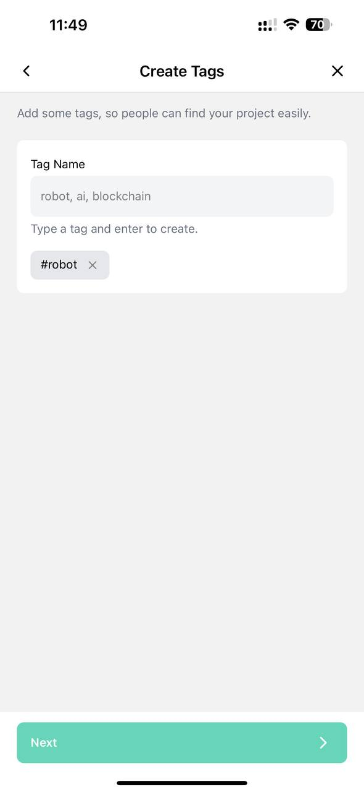
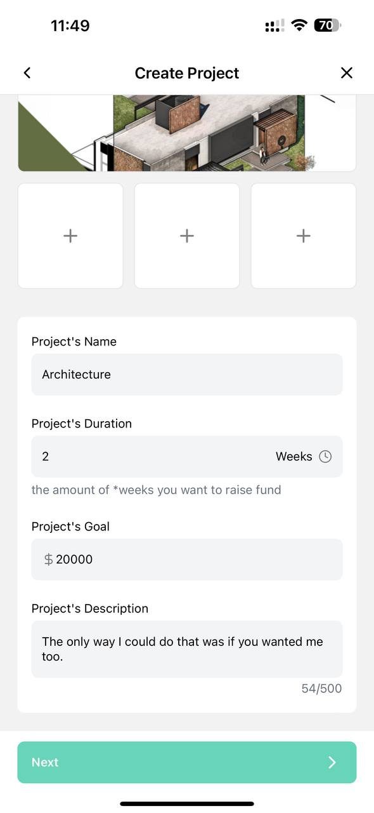
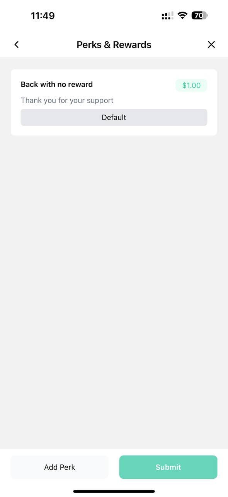
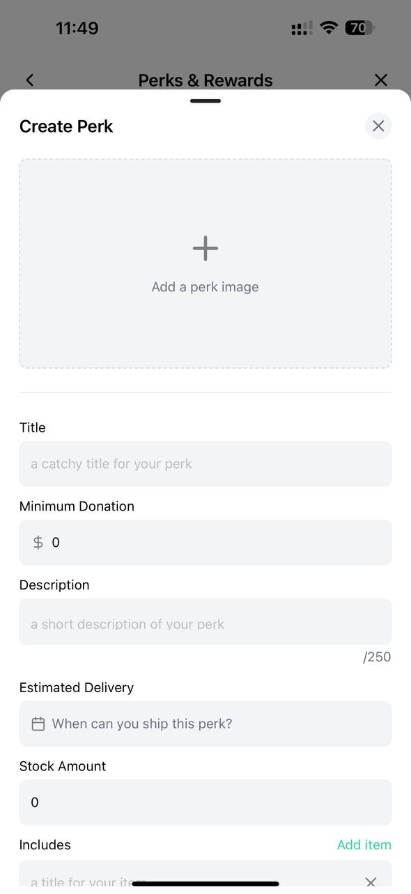

# 🌕 How to Create the Project

### 1. Click on " + " Button

<figure><figcaption></figcaption></figure>

### 2. Navigate to the Create Screen

Follow all of the screen do it step by step once you done all of it click on " Submit " .

<figure><figcaption></figcaption></figure>

 

<figure><figcaption></figcaption></figure>

 

<figure><figcaption></figcaption></figure>

<figure><figcaption></figcaption></figure>

 

<figure><figcaption></figcaption></figure>

 

<figure><figcaption></figcaption></figure>

