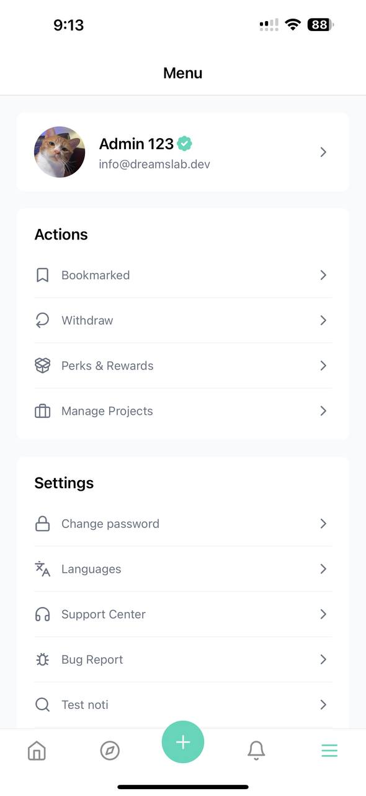
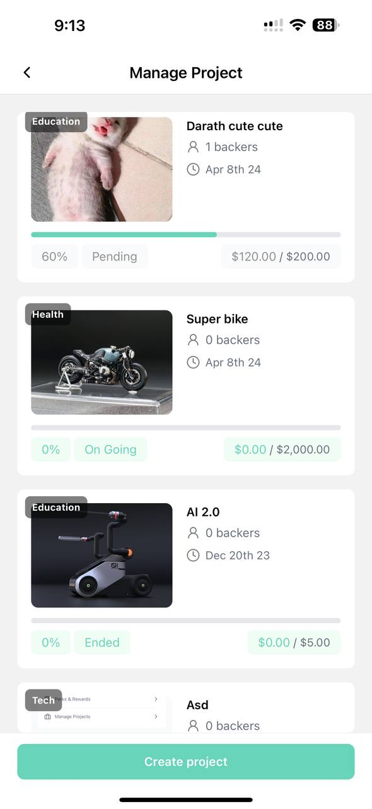
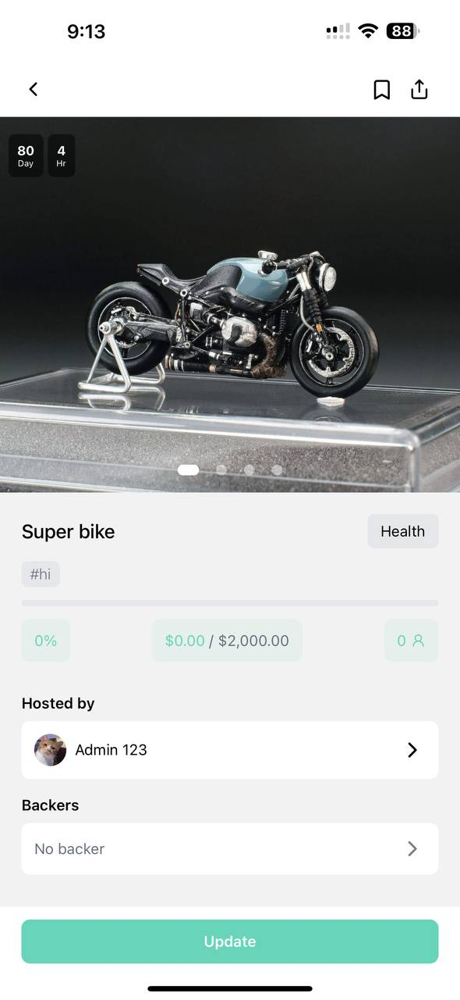
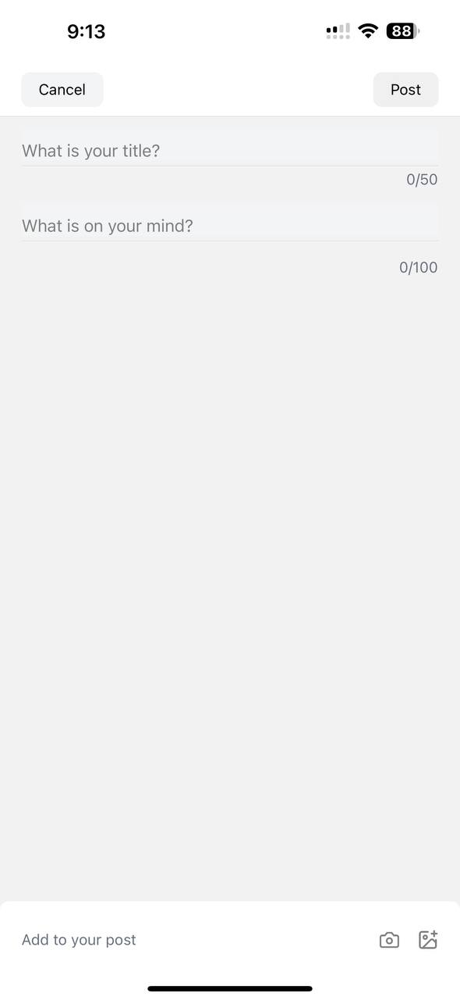
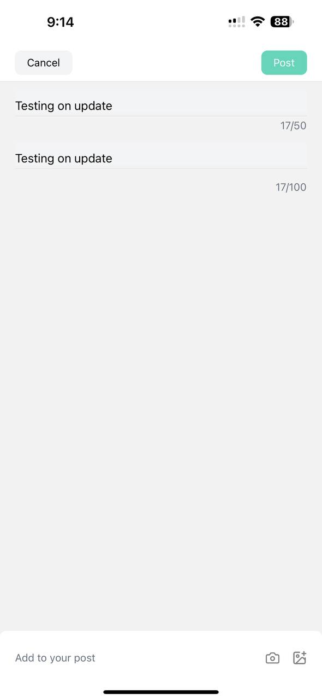

# 📖 How to create the project&#x20;


Important Notes

* Make sure your account if Verified
* Put a clear , detail purpose of the project and delivery as promised.


### 1. Go to Menu&#x20;

Navigate to the menu section of the application.

<figure><figcaption></figcaption></figure>

### 2. Pick Your Ongoing Project

Select the project you are currently working on from the list.

<figure><figcaption></figcaption></figure>

**2.1 Click on Update**

Access the update feature within the project interface.

<figure><figcaption></figcaption></figure>

**2.2 Write Header and Title of the Update**&#x20;

* Enter a concise and descriptive header that summarizes the essence of your update .
* Provide a compelling title that captures the main focus or achievement.

<figure><figcaption></figcaption></figure>

*

**2.3 Post Update**

Click on " Post " button to share your update with everyone .

<figure><figcaption></figcaption></figure>

