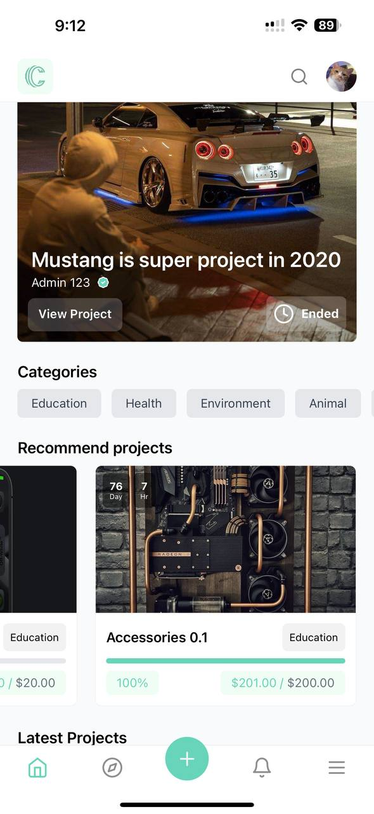
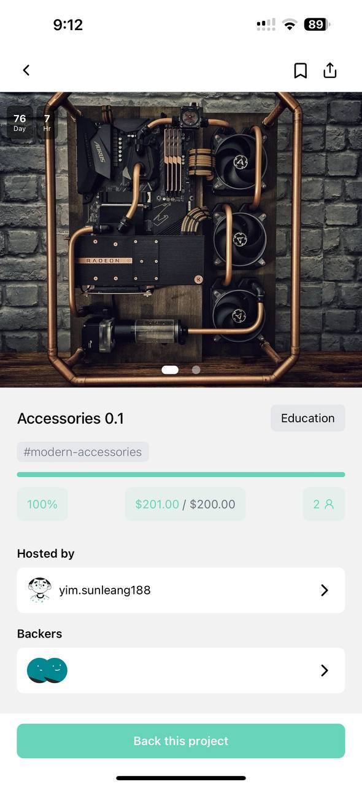
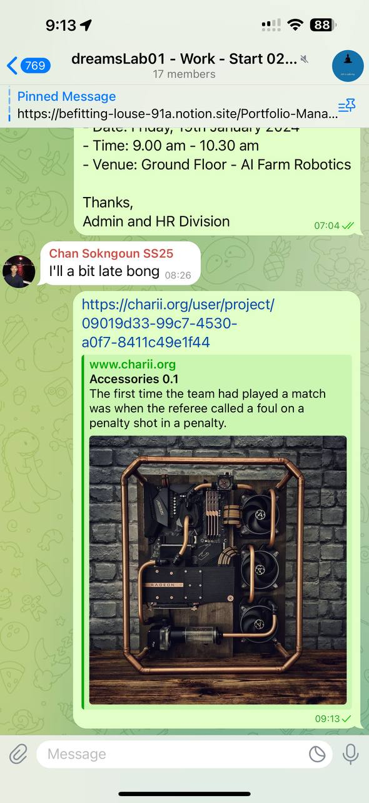

# 🪛 How to Share

### 1. Select Any Project

Choose the project you want to share from the list of available projects.

<figure><figcaption></figcaption></figure>

### 2. Click on Share Button

Locate the top-right corner of the project interface. Tap or click on " Share " icon .

<figure><figcaption></figcaption></figure>

 

<figure><figcaption></figcaption></figure>

