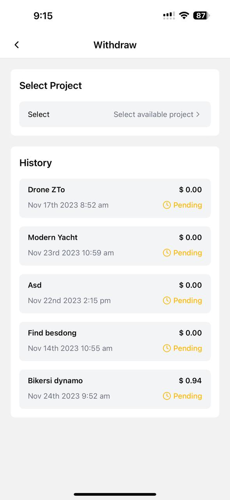
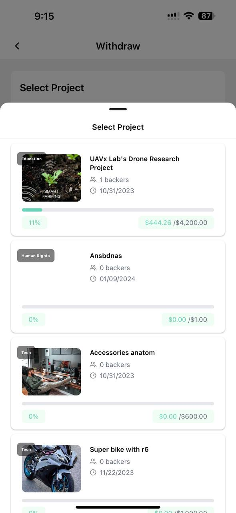
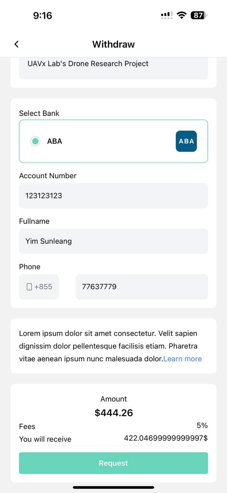
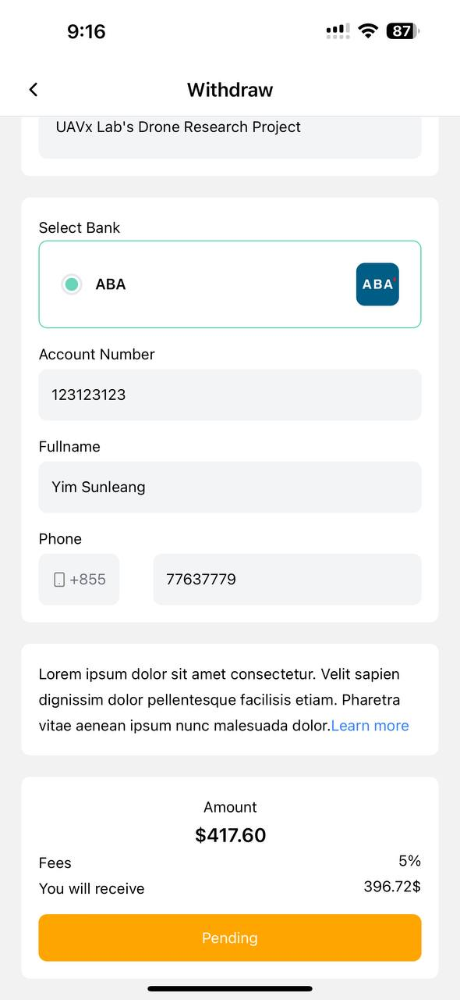
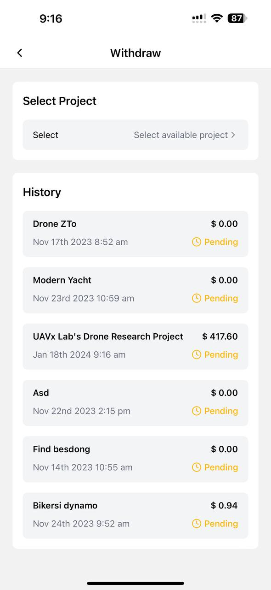

# 💲 How to Withdraw

### 1. Go to Menu

Navigate to the menu section of the application.

#### 1.1 Click on Withdraw

Access the withdrawal feature, found in the menu section.

<figure><figcaption></figcaption></figure>

### 2. Select Available Withdraw Project

Choose the project from which you wish to withdraw funds when the project period is ended .

<figure><figcaption></figcaption></figure>

 

<figure><figcaption></figcaption></figure>

### 3. Fill Information

Enter the required withdrawal details, which may include:

* Bank Account

<figure><figcaption></figcaption></figure>

* Phone Number
* Preferred withdrawal method (e.g., bank transfer ( ABA ) ).
* Review the entered information to ensure accuracy.

### 4. Click on " Request "

Once confident in the provided details, click the "Request" or equivalent button to initiate the withdrawal process.

<figure><figcaption></figcaption></figure>

 

<figure><figcaption></figcaption></figure>

